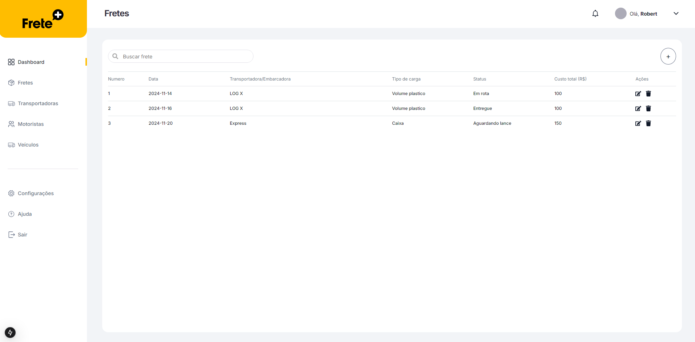

<p align="center">
    
</p>

| Aplicação de simulação de gerenciamento de fretes

<p align="center">
    
</p>

## 💻 Tecnologias utilizadas
- ReactJS
- NextJS
- React Hooks
- Hook Form
- Axios

Clone o projeto e acesse a pasta

```bash
$ git clone https://github.com/DenilsonMelo/challenge-fm-front.git && cd challenge-fm-front
```
```bash
# Instale as dependências
$ yarn

# Execute o projeto
$ yarn dev
```


❗❗❗ Vá para o repositório  [https://github.com/DenilsonMelo/challenge-fm-api](https://github.com/DenilsonMelo/challenge-fm-api) finalizar a setup de inicialização da aplicação❗❗❗


| Crie um arquivo ```.env.develoment``` com a ```NEXT_PUBLIC_API=porta_que_esta_rodando_api```


Após isso, abra [http://localhost:3000](http://localhost:3000) em seu browser preferido para ver o resultado.